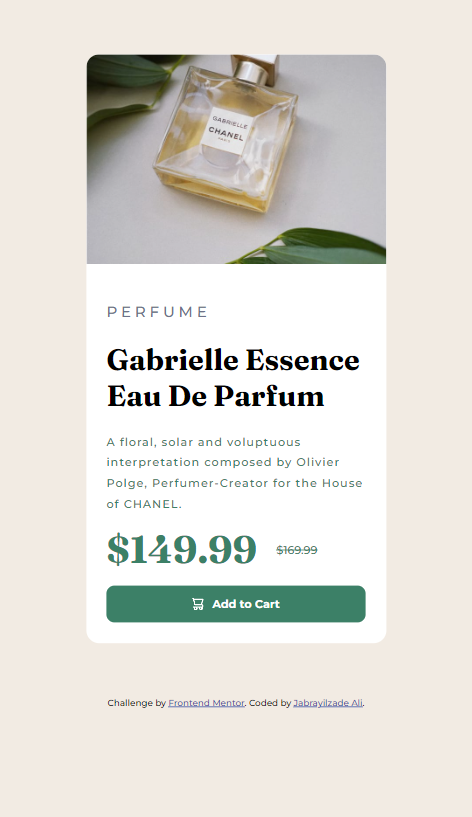

# Frontend Mentor - Product preview card component solution

This is a solution to the [Product preview card component challenge on Frontend Mentor](https://www.frontendmentor.io/challenges/product-preview-card-component-GO7UmttRfa). Frontend Mentor challenges help you improve your coding skills by building realistic projects. 

## Table of contents

- [Overview](#overview)
  - [The challenge](#the-challenge)
  - [Screenshot](#screenshot)
  - [Links](#links)
- [My process](#my-process)
  - [Built with](#built-with)
  - [What I learned](#what-i-learned)
  - [Useful resources](#useful-resources)
- [Author](#author)


## Overview

### The challenge

Users should be able to:

- View the optimal layout depending on their device's screen size
- See hover and focus states for interactive elements
- Create exact design

### Screenshot





### Links

- Solution URL: [Add solution URL here]()
- Live Site URL: [Add live site URL here](https://jabrayilzadeali.github.io/product-preview-card-component-by-frontendmentor/)


### Built with

- Semantic HTML5 markup
- CSS custom properties
- Flexbox
- CSS Grid
- Mobile-first workflow


### What I learned

I learned css grid

To see how you can add code snippets, see below:

```html
<!DOCTYPE html>
<html lang="en">
<head>
  <meta charset="UTF-8">
  <meta name="viewport" content="width=device-width, initial-scale=1.0"> <!-- displays site properly based on user's device -->

  <link rel="icon" type="image/png" sizes="32x32" href="./images/favicon-32x32.png">
  
  <title>Frontend Mentor | Product preview card component</title>
  <link rel="preconnect" href="https://fonts.googleapis.com">
  <link rel="preconnect" href="https://fonts.gstatic.com" crossorigin>
  <link href="https://fonts.googleapis.com/css2?family=Barlow+Condensed:wght@300;400;500;600&family=Montserrat:wght@500;700&display=swap" rel="stylesheet">

  <link rel="preconnect" href="https://fonts.googleapis.com">
  <link rel="preconnect" href="https://fonts.gstatic.com" crossorigin>
  <link href="https://fonts.googleapis.com/css2?family=Barlow+Condensed:wght@300;400;500;600&family=Fraunces:opsz,wght@9..144,700&display=swap" rel="stylesheet">

  <!-- Feel free to remove these styles or customise in your own stylesheet 👍 -->
  <style>
    .attribution { font-size: 11px; text-align: center; }
    .attribution a { color: hsl(228, 45%, 44%); }
  </style>
  <link rel="stylesheet" href="style.css">
  
</head>
<body>
  <div class="center-element">
    <main class="grid card">
      <div class="desktop-img-div">
        
      </div>
      <div class="mobile-img-div">
        
      </div>
      <div class="content">
        <h3>Perfume</h3>
        <h1 class="heading">Gabrielle Essence Eau De Parfum</h1>
        <p class="description">
          A floral, solar and voluptuous interpretation composed by Olivier Polge, 
          Perfumer-Creator for the House of CHANEL.
        </p>
        <div class="price">
          <h2>$149.99</h2>
          <p>$169.99</p>
        </div>
        <div class="add-to-card center-element">
          
          <p>Add to Cart</p>
        </div>
      </div>
    </main>
  </div>
  <div class="attribution">
    Challenge by <a href="https://www.frontendmentor.io?ref=challenge" target="_blank">Frontend Mentor</a>. 
    Coded by <a href="#">Jabrayilzade Ali</a>.
  </div>
</body>
</html>
```
```css
:root {
    /* Primary */
    --Dark-cyan: hsl(158, 36%, 37%);
    --Cream: hsl(30, 38%, 92%);
    /* Secondary */
    --Very-dark-blue: hsl(212, 21%, 14%);
    --Dark-grayish-blue: hsl(228, 12%, 48%);
    --White: hsl(0, 0%, 100%);
}

body {
    margin: 0;
    height: 100vh;
    display: grid;
    background-color: var(--Cream);

    font-family: "Montserrat";
}

p {
    font-size: 14px;
}

h3 {
    font-family: "Montserrat";
    font-weight: 500;
    letter-spacing: .3rem;
    color: var(--Dark-grayish-blue);
    text-transform: uppercase;
}

.card {
    border-radius: 1rem;
}

.desktop-img, .mobile-img {
    width: 100%;
}

.mobile-img {
    border-top-left-radius: 1rem;
    border-top-right-radius: 1rem;
}

.desktop-img {
    border-top-left-radius: 1rem;
    border-bottom-left-radius: 1rem;
}

main {
    background-color: var(--White);
}

.grid {
    display: grid;
    grid-template-rows: auto;
    grid-template-columns: 375px;
}


.center-element {
    display: flex;
    align-items: center;
    justify-content: center;
}

.desktop-img-div {
    display: none;
}

.content {
    padding: 1.6rem;
}

.heading {
    font-size: 2.3rem;
    font-family: "Fraunces";
}

.description {

    color: var(--Dark-cyan);
    line-height: 1.6rem;
    letter-spacing: .08rem;
}

.price {
    display: flex;
    align-items: center;
    margin-bottom: 1rem;
}

.price h2 {
    color: var(--Dark-cyan);
    font-family: "Fraunces";
    font-size: 3rem;
    margin: 0;
}

.price p {
    padding-left: 1.5rem;
    color: var(--Dark-cyan);
    margin: 0;
    text-decoration: line-through;
}


.add-to-card {
    background-color: var(--Dark-cyan);
    border-radius: 10px;
    font-weight: 700;
    gap: 10px;
    color: var(--White);
}

.add-to-card:hover {
    background-color: #1a4031;
}

@media screen and (min-width: 1440px) {
    .grid {
        grid-template-columns: 1fr 1fr;
    }

    .desktop-img-div {
        display: inline-block;
    }

    .mobile-img-div {
        display: none;
    }

    .card {
        width: 842px;
    }


    .heading {
        font-size: 3rem;
        margin-top: 0;
    } 

    .content {
        display: flex;
        flex-direction: column;
        justify-content: space-around;
        padding: 3rem;
    }

    .description {
        /* padding-right: 2rem; */
        font-size: 1rem;
        margin: 0;
    }

    /* .add-to-card {
        margin-right: 2rem;
    } */


    main {
        height: 631.25px;
    }

}
```

### Useful resources

- [Css Tricks](https://css-tricks.com/snippets/css/complete-guide-grid/) - Css grid with excellent vizualizations.


## Author

- Frontend Mentor - [Jabrayilzade Ali](https://www.frontendmentor.io/profile/jabrayilzadeali)
- Twitter - [Jabrayilzade Ali](https://twitter.com/JabrayilzadeAli)
